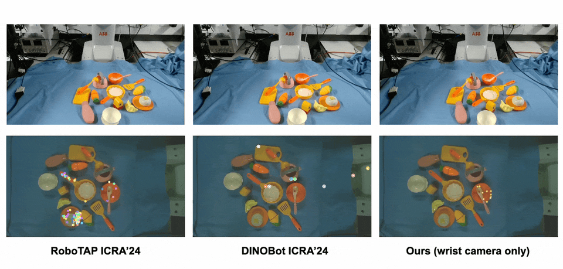

# ODIL-VS

This repository provides a lightweight implementation of the **wrist-camera-based visual servoing (VS) controllers** from [ODIL](https://arxiv.org/abs/2503.06831) with minimal dependencies. <br> The code has been tested on ROS 2 using a ViperX 300s arm (ALOHA) equipped with an Intel RealSense D405 wrist camera and a joint position controller.



## Structures

```
ODIL-VS/
├── config/
│   ├── config.py            # Configuration file
│   ├── handeye_4x4.npy      # Hand–eye calibration (camera optical frame in EE frame)
│   ├── intrinsic_3x3.npy    # Camera intrinsic matrix
│   └── robot.py             # Robot interface
├── example_tasks/
│   └── pan/
│       ├── ref_rgb_wrist.png      # Example bottleneck RGB image
│       ├── ref_depth_wrist.npy    # Example bottleneck depth map
│       ├── ref_mask_wrist.png     # Example bottleneck RGB image mask
│       └── ref_ee_pose.npy        # Example bottleneck EE pose (4x4 matrix)
├── match_servoers/
│   ├── base_servoer.py           # Base class for visual servoers (ROS 2)
│   ├── base_servoer_ros1.py      # Base class for visual servoers (ROS 1)
│   ├── dino_servoer.py           # DINO correspondence for visual servoers
│   └── lightglue_servoer.py      # LightGlue for visual servoers
├── main.py                       # Main entry point
├── vs3d.py                       # 3D visual servoing with UKF (Stage 2)
├── vs25d.py                      # 2.5D visual servoing with homography (Stage 3)
├── dinobot.py                    # Real-time implementation of DINOBot (~2 Hz)
├── vs_utils.py                   # Utility functions for visual servoers
├── requirements.txt              # Dependencies (not all need to be installed)
└── README.md                     # You are here
```

## Getting Started

1. Install [LightGlue](https://github.com/cvg/LightGlue).

2. Update the camera and robot files in the `config/` folder for your specific hardware setup.

3. Update the `example_tasks/` folder with your RGB-D image taken at an EE pose and its segmentation mask.

4. Run the main script:
python main.py.

   
## Notes

1. **DINOBot**  
   If you only want to run [DINOBot](https://arxiv.org/abs/2402.13181) in real time, you do **not** need to install LightGlue. Instead, check `dinobot.py` and `match_servoers/dino_servoer.py`.

2. **LightGlue Sensitivity**  
   LightGlue can be sensitive to lighting conditions. If you experience poor convergence performance, consider **retaking the images** and trying again.

3. **PID Tuning**  
   The 2.5D visual servoing in this repository is implemented with a PID controller and may require additional tuning for your specific setup.

4. **ROS 1 Support**  
   If you use ROS 1, you can inherit the visual servoing controllers from `match_servoers/base_servoer_ros1.py` and update the Python files accordingly (e.g., use `rospy` instead of `rclpy`).

   

## BibTeX Citation

If you find this repository useful for your project, please consider citing us!

```bibtex
@article{Wang2025OneShotDI,
  title={One-Shot Dual-Arm Imitation Learning},
  author={Yilong Wang and Edward Johns},
  journal={2025 IEEE International Conference on Robotics and Automation (ICRA)},
  year={2025},
  pages={5660-5668},
  url={https://api.semanticscholar.org/CorpusID:276902584}
}
```